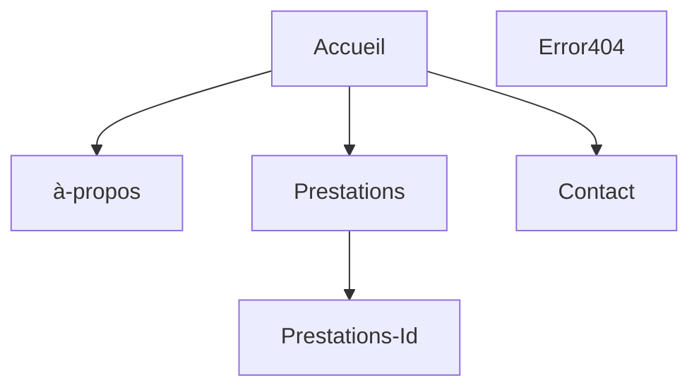

## 🚀 Bienvenue sur mon projet checkpoint 4 réalisé à la Wild Code School  

## 💡 Le concept

Réalisation d'un site vitrine pour une esthéticienne pour faire de la publicité.

## 🛠️ Fonctionnalités:

### 👥 Partie Utilisateur:

- L'utilisateur pourra naviquer sur plusieurs pages.
- L'utilisateur pourra voir les détails de chaques préstations proposé.
- L'utilisateur pourra envoyer un mail pour contacter l'administrateur du site.

### 📝 Dans cette version:

- Les pages sont fonctionnels
- Il est possible de voir les prestations en détail
- La page contact est fonctionnel

### 🔜 A venir:

- Ajouter des photos supplémentaires aux prestations dèja présentes

## 🏗️ Structure de l'application

## 📈 Statut du projet

v1.0 en cours

## Technos utilisé

## 💻 Modélisation de la base de données

## 🛠️ Setup & utilisation

### 📜 Commandes disponibles

- `npm i` : Initialisation du frontend et du backend, ainsi que de tous les outils
- `npm run db:migrate` : Exécute le script de migration de la base de données
- `npm run db:seed`: Injecte dans la base de données
- `npm run dev` : Démarre les deux serveurs (frontend + backend) dans un seul terminal
- `npm run dev:client` : Démarre le serveur frontend React
- `npm run dev:server` : Démarre le serveur backend Express
- `lint` : Exécute les outils de validation et refuse le code non conforme (sera exécuté à chaque _commit_)
- `fix` : Corrige les erreurs de linter (exécutez-le si `lint` grogne sur votre code !)

## 📄 Plus d'informations

- Le modèle utilisé pour ce projet est un modèle de fondation Fullstack réalisé par la Wild Code School.

- N'oubliez pas de créer vos fichiers .env pour le frontend et le backend en copiant les fichiers .env.sample de chaque répertoire.

### 🔧 Outils utilisé :

- _Concurrently_ : Permet de lancer plusieurs commandes simultanément dans la même interface de ligne de commande (CLI).
- _Husky_ : Permet d'exécuter des commandes spécifiques déclenchées par des événements git.
- _Vite_ : Alternative à Create-React-App, offrant moins d'outils pour une expérience plus fluide.
- _ESLint_ : Outil de "qualité du code", garantit que les règles choisies seront appliquées.
- _Prettier_ : Outil de "qualité du code" également, se concentre sur le guide de style.
- _Airbnb Standard_ : L'un des "standards" les plus connus, bien qu'il ne soit pas officiellement lié à ES/JS.
- _Nodemon_ : Permet de redémarrer le serveur à chaque mise à jour d'un fichier .js.

### 👥 Créateur :

[Nicolas JUCHEREAU](https://github.com/Nicolas-jchr)
